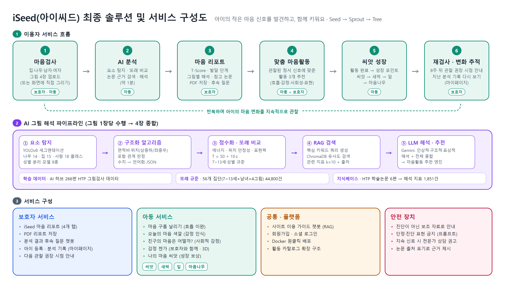
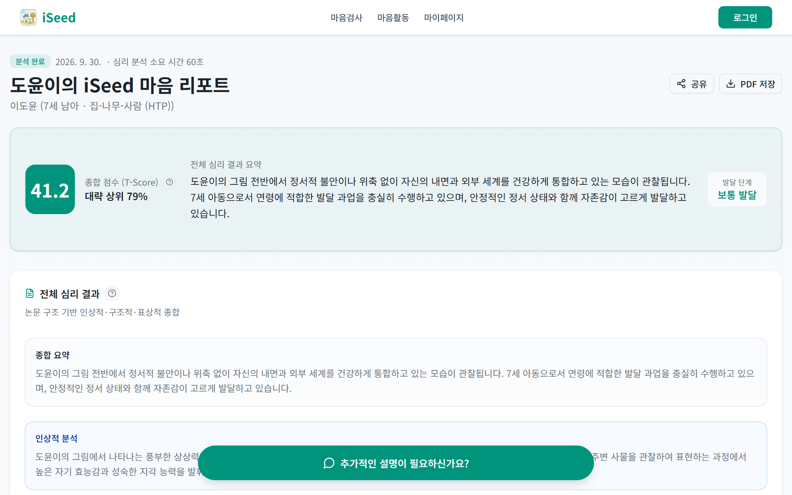
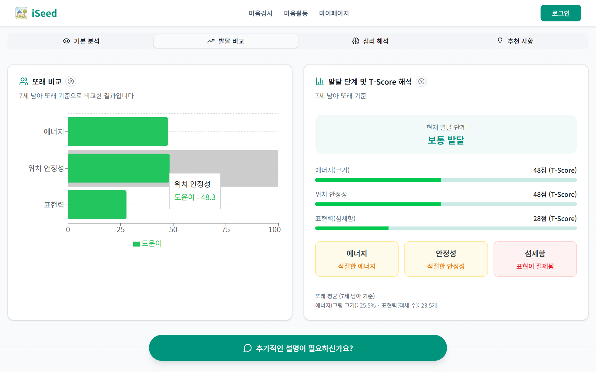
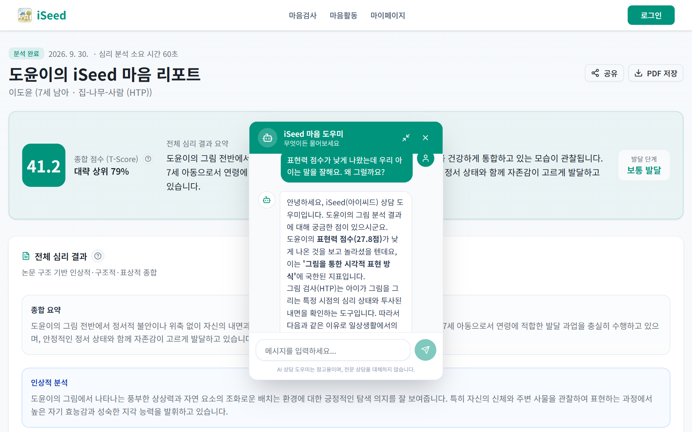
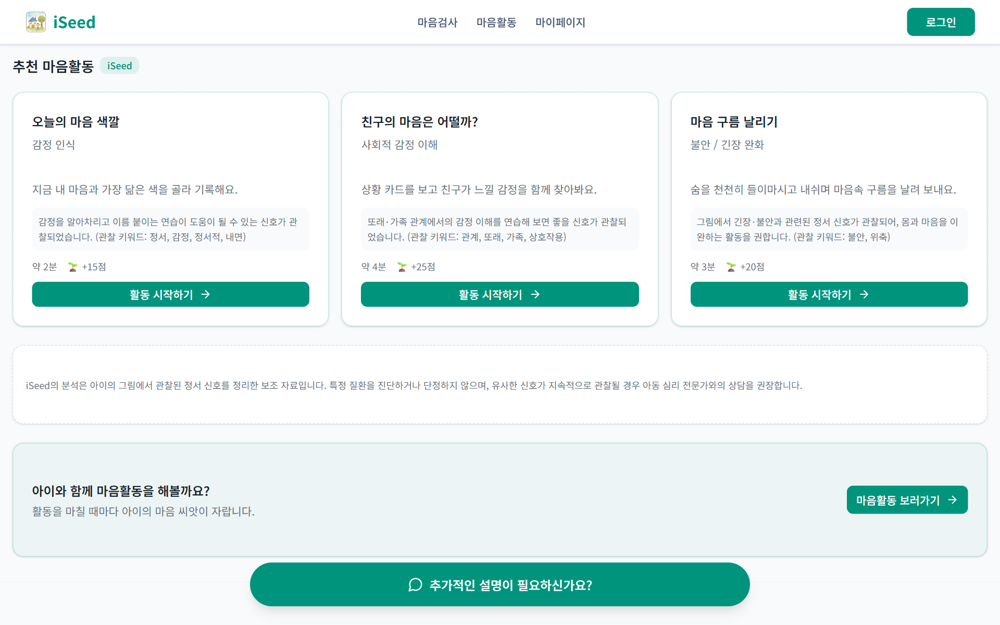
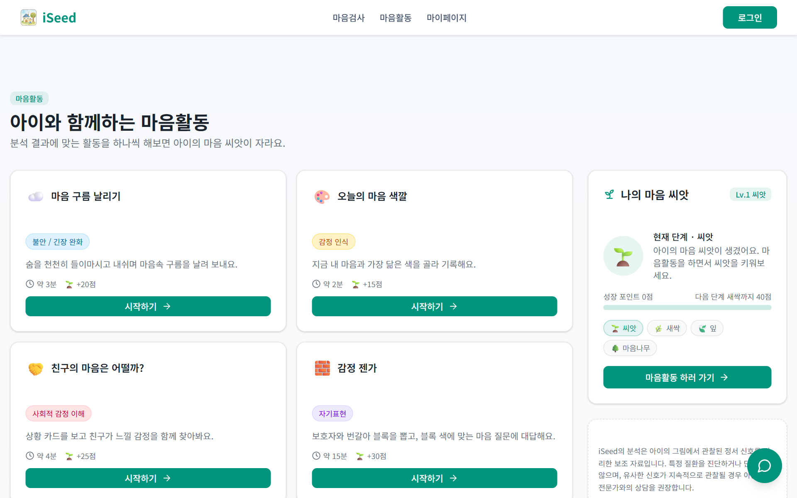
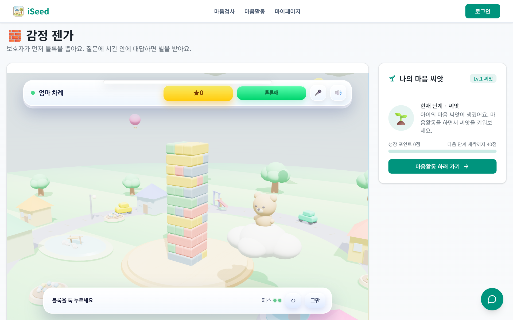
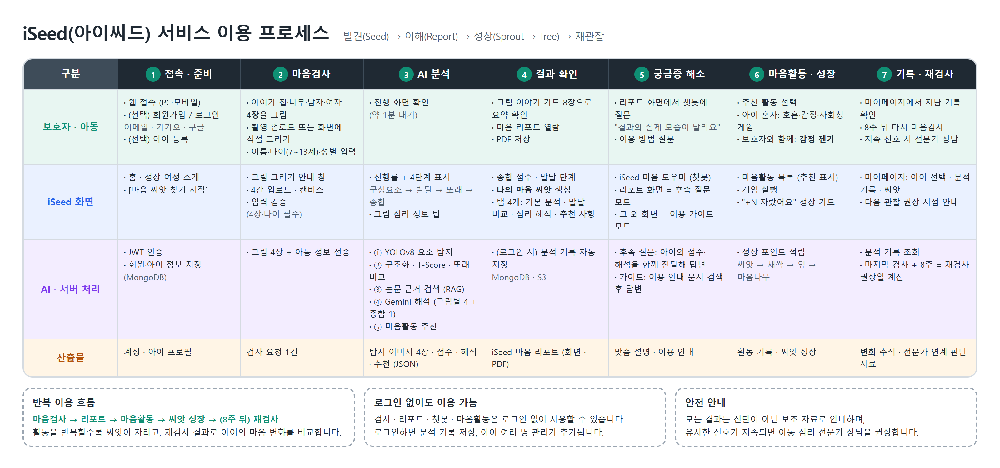
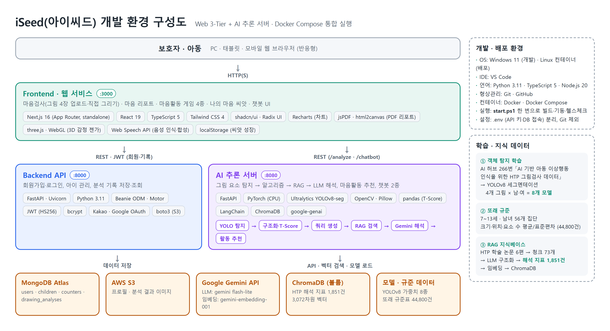

<p align="center">
  
</p>

<h1 align="center">iSeed (아이씨드)</h1>

<p align="center">
  아이의 작은 마음 신호를 발견하고, 함께 키워요.<br>
  그림 속 신호를 AI로 살펴보고, 보호자용 마음 리포트와 맞춤 마음활동으로 이어 주는 아동 정서지원 서비스
</p>

---

## 소개

아이는 마음을 말로 다 설명하지 못합니다. iSeed는 아이가 그린 집·나무·사람(HTP) 그림 4장을 분석해
또래와 비교한 점수와 학술 논문에 근거한 해석을 **보호자가 읽기 쉬운 리포트**로 정리하고,
결과에 맞는 **마음활동**을 추천합니다. 활동을 마칠 때마다 아이의 **마음 씨앗**이 새싹, 잎, 마음나무로 자랍니다.

> iSeed의 분석은 그림에서 관찰된 정서 신호를 정리한 보조 자료이며, 전문적인 심리 진단을 대체하지 않습니다.

<p align="center">
  
</p>

## 주요 기능

| 기능 | 내용 |
|------|------|
| 마음검사 | 그림 4장 업로드 또는 화면에 직접 그리기, 나이(7~13세)·성별 입력 |
| AI 그림 분석 | YOLOv8 요소 탐지 → 구조화 → 또래 비교(T-Score) → 논문 근거 검색(RAG) → Gemini 해석, 약 1분 |
| 마음 리포트 | 종합 점수, 발달 단계, 그림별 해석, 참고 논문, 보호자 추천 사항, PDF 저장 |
| AI 챗봇 | 리포트 화면에서는 우리 아이 결과에 대한 후속 질문, 그 외 화면에서는 이용 안내 |
| 마음활동 | 분석 결과에 맞춘 활동 추천, 게임 4종 (호흡 · 감정 인식 · 친구 마음 · 감정 젠가) |
| 마음 씨앗 | 활동 완료 시 성장 포인트 적립, 씨앗 → 새싹 → 잎 → 마음나무, 8주 뒤 재검사 안내 |

## 화면

| 마음 리포트 | 또래 비교 (T-Score) |
|:---:|:---:|
|  |  |
| **분석 결과 후속 질문 챗봇** | **추천 마음활동** |
|  |  |
| **마음활동 목록** | **감정 젠가 (보호자와 함께하는 3D 게임)** |
|  |  |

## 이용 흐름

<p align="center">
  
</p>

## 구조

<p align="center">
  
</p>

| 서비스 | 폴더 | 기술 | 포트 |
|--------|------|------|------|
| Frontend | [`iSeed-Frontend-Docker`](iSeed-Frontend-Docker) | Next.js 16, React 19, TypeScript, Tailwind CSS 4, shadcn/ui, Recharts, three.js | 3000 |
| Backend | [`iSeed-Backend-Docker`](iSeed-Backend-Docker) | FastAPI, MongoDB(Beanie), JWT, bcrypt, AWS S3 | 8000 |
| AI Models | [`iSeed-AiModels-Docker`](iSeed-AiModels-Docker) | FastAPI, PyTorch(CPU), Ultralytics YOLOv8, LangChain, ChromaDB, Google Gemini | 8080 |
| RAG | [`rag`](rag) | HTP 해석 지표 1,851건, ChromaDB | - |

### 그림 해석 파이프라인

1. **요소 탐지**: 그림 종류(나무·집·남자·여자) × 성별로 학습한 YOLOv8 세그멘테이션 모델 8종. 나무 14, 집 15, 사람 18개 클래스
2. **구조화**: 탐지 좌표를 위치(상·중·하, 좌·중·우), 면적 비율, 포함 관계로 언어화
3. **점수화**: 같은 나이·성별 규준과 비교해 에너지·위치 안정성·표현력 T-Score 산출 (T = 50 + 10z)
4. **근거 검색**: 핵심 키워드로 HTP 논문 지표를 검색해 관련 지표 10건과 출처를 LLM에 전달
5. **해석**: Gemini가 그림별 인상적·구조적·표상적 해석과 보호자 추천을 작성하고 4장을 종합
6. **활동 추천**: 해석 결과를 읽기만 하는 후처리 모듈이 정서 5영역 신호를 계산해 마음활동 3개 추천

## 실행

### 준비물

- Docker Desktop
- Gemini API 키 ([Google AI Studio](https://aistudio.google.com/apikey))
- 로그인·기록 저장을 쓰려면 MongoDB 접속 주소 (MongoDB Atlas 무료 플랜 가능)

### 1. 환경 변수

```bash
cp .env.example .env
```

서비스별 `.env` 파일을 만듭니다. 항목은 각 폴더 README를 참고하세요.

| 파일 | 필수 항목 |
|------|----------|
| `iSeed-AiModels-Docker/.env` | `GEMINI_API_KEY`, `GOOGLE_API_KEY`, `GEMINI_API_KEYS` (모두 같은 키) |
| `iSeed-Backend-Docker/.env` | `JWT_SECRET`, `MONGODB_URI`, `MONGODB_DB_NAME` |

### 2. 실행

```bash
docker compose up --build
```

Windows에서는 `.\start.ps1` 한 번으로 환경 확인, 빌드, 실행, 상태 확인까지 진행됩니다. 종료는 `.\stop.ps1`.

| 주소 | |
|------|---|
| http://localhost:3000 | 서비스 |
| http://localhost:8080/health | AI 서버 상태 |
| http://localhost:8080/rag/status | RAG 적재 상태 (`ready: true` 확인) |
| http://localhost:8000/health | Backend 상태 |

### Docker 없이 실행 (Windows)

Python 3.11~3.12, Node.js 20 이상이 필요합니다.

```powershell
.\start-local.ps1          # 처음 한 번은 의존성 설치 포함 (10~20분)
.\start-local.ps1 -SkipInstall
.\stop-local.ps1
```

## RAG 지식베이스

`rag/chroma` 에 논문 지표 1,851건이 임베딩되어 있어 받은 그대로 동작합니다.
다시 만들어야 할 때만 아래를 실행하세요. 이미 적재되어 있으면 아무것도 하지 않습니다.

```bash
docker compose run --rm aimodels python /app/rag/scripts/init_rag.py          # 비어 있을 때만 생성
docker compose run --rm aimodels python /app/rag/scripts/init_rag.py --force  # 강제 재생성
```

- 임베딩 모델은 `RAG_EMBEDDING_MODEL` (기본 `models/gemini-embedding-001`). 색인과 검색은 같은 모델을 써야 합니다.
- 해석·챗봇 모델은 `GEMINI_MODEL` (기본 `gemini-3.5-flash-lite`). 무료 한도는 키가 아니라 Google Cloud 프로젝트 단위입니다.

## 폴더 구조

```
iSeed/
├─ iSeed-Frontend-Docker/     웹 서비스 (Next.js)
├─ iSeed-Backend-Docker/      회원·자녀·분석 기록 API (FastAPI + MongoDB)
├─ iSeed-AiModels-Docker/     그림 분석·해석·추천·챗봇 (FastAPI + YOLOv8 + Gemini)
├─ rag/
│  ├─ chroma/                 HTP 해석 지표 벡터 DB
│  ├─ dataset/                논문에서 추출한 지표 1,851건 (JSON)
│  ├─ papers/                 논문 PDF 위치 (저장소 미포함, 목록은 README 참고)
│  └─ scripts/                지표 추출·색인 스크립트
├─ docs/                      구조 설명, 변경 이력, 테스트 결과, README 이미지
├─ docker-compose.yml
├─ start.ps1 / stop.ps1       Docker 실행·종료 (Windows)
└─ start-local.ps1 / stop-local.ps1
```

## 데이터 출처

| 데이터 | 출처 | 저장소 포함 여부 |
|--------|------|----------------|
| HTP 그림검사 데이터 (그림 요소 탐지 학습, 또래 통계) | AI 허브 266번 「AI 기반 아동 이상행동 인식을 위한 HTP 그림검사 데이터」 | 원천 데이터 미포함. 학습된 가중치와 집계 통계만 포함 |
| T점수 체계 | 손성희(2015), 모바일 기반 HTP그림검사 앱 개발을 위한 표준화 연구 | - |
| HTP 해석 지표 | 국내 학술 논문 6편 ([목록](rag/papers/README.md)) | 논문 원문 미포함. 추출한 지표와 벡터 DB만 포함 |
| 지역아동센터·상담기관 목록 | 공공데이터포털 | 포함 (`iSeed-Frontend-Docker/json`) |

## 문서

- [구조 상세](docs/ARCHITECTURE.md): 분석 파이프라인, 챗봇, 회원 데이터 구조
- [변경 이력](docs/CHANGES.md): 원본 프로젝트(AiMind) 대비 변경점과 발견한 문제
- [테스트 결과](docs/E2E-TEST.md): 실제 실행 검증 기록
